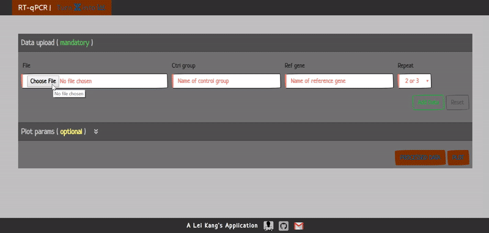

# RT-qPCR_Plot

**To analyze qPCR results and generate bar plot accordingly**

## Data read-in and analysis

To make it simple, <code>.csv</code> is the only valid format for data input. The sample data file is generated using **Applied Biosystems ViiA 7**. Should there be other systems being used, make sure the columns for ***experimental groups***, ***genes of interest***, and ***cycle threshold (ct) values*** are labeled as ***"Sample Name"***, ***"Target Name"***, and ***"CT"***, respectively. Also ensure that there is **"_"** in neither *"Sample Name"* nor *"Target Name"*. Name of ***control group*** as well as that for ***reference gene*** are expected to complete the following data analysis. Also, ***number of parallel ct values (experimental repeat, 2 or 3)*** needs to be pointed out.

If the qPCR experiment is performed with an experimental repeat of 3, ct outliers should be identified and removed before analyzing the data for bar plot. Here, **the most distant ct value apart from the middle one with a delta ct greater than 1 (2 folds)** is considered as an outlier.

The **2-Delta Delta CT method** is applied in comparing relative gene activation (target gene / reference gene) between treatment and control groups. Basically, average ct values of reference gene in different sample groups are retrieved, which then serve as reference in calculating relative activation of target genes by individual ct values. In comparing the fold change in relative gene activation between treatment and control groups, cumulative distribution function (<code>stats.f.cdf()</code>) is used to check if the variances are equal, which eventually become a parameter for Student t-test (<code>stats.ttest_ind()</code>).

For those who would like to make the plot themselves, processed data can be downloaded by simply clicking the **PROCESSED DATA** button.

## Bar plot

There are many parameters a user can specify in order to personalize his/her final plot. By default, the bars can be arranged according to the alphabet of the names of genes in either descending or ascending order. But if there are only one control and one treatment group, sorting by values of relative activation in treatment group becomes available. After the number of sample groups is given, the user can assign bar color for each individual sample group. Also, the user can set up the minimum of total bars to be displayed if plotted horizontally. Threshold of fold change in values between two adjacent bars is used to determine if a break in the axis of values is required. It can be set up by user as well. Moreover, *graph title*, *label for axis of values*, *alpha transparency of bar color*, *cap size of error bars* (only show the large value half), and *location of legend* are all parameters the user can play with.

Application is deployed on Heroku and can be accessed <a href="https://koudash-qpcr-plot.herokuapp.com/">here</a>.

A demo is posted below.

